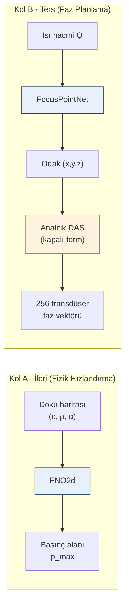

# Soft-Tissue — Heterojen Meme Dokusunda HIFU Planlaması için Sinir Vekil Modelleri

> Sempozyum makalesi için hazırlanan çalışma deposudur (deadline **01.05.2026**).
> Pazartesi 28.04 ofiste danışman görüşmesi gündem dokümanı:
> [`reports/pazartesi_toplanti.md`](reports/pazartesi_toplanti.md).

---

## Bu çalışma neyi çözüyor?

Yüksek yoğunluklu odaklanmış ultrason (HIFU) tümörü termal olarak yok eder.
Klinikte odak noktasının hastaya özgü doku heterojenliği altında milimetrik
doğrulukla yerleştirilmesi gerek; ancak referans çözücü (k-Wave) RTX 4070'te
**konfigürasyon başına ~60 saniye** sürdüğünden interaktif planlama
yapılamıyor. Frekans-domeni Helmholtz çözücüleri / ışın izleme / lookup
tablosu — her biri farklı bir eksende tökezler (geçici bilgi, kırılma
kuyruğu, hastaya adaptasyon kayıpları). **Bu boşluk AI vekil modellerinin
mühendislik gerekçesidir** — sihir değil, hız + GPU bağımsızlığı + adaptasyon
üçlüsünü aynı anda veren tek yol.

---

## Pipeline

Kol A öğrenilmiş forward vekili, Kol B 3-DOF odak regresörü + analitik
hüzmelendirme. İlk yaklaşım (256 fazın doğrudan tahmini) gauge simetrisi
ve tek-çoğa eşleme nedeniyle çöktüğü için 3-DOF yeniden formülasyonu
yaptık.

---

## Ana Sonuçlar

**Kol A — 2-B forward (1 000 OpenBreastUS örneği):**

| Omurga      | Test rel-L2 | vs k-Wave wallclock |
|-------------|-------------|---------------------|
| **FNO2d**   | **0.097**   | **~7 500× hızlanma** (60 s → 8 ms) |
| U-Net2d     | 0.264       | — |
| ConvNeXt2d  | 0.990       | (jenerik CNN bu görevde başarısız — spektral öncelik baskın) |

**Kol B — 3-B inverse (30 hacim, 22/4/4 split, 3 seed multi-seed ortalaması):**

| Yöntem | Lateral X (mm) | Lateral Y (mm) | Z (mm) | Wallclock |
|---|---:|---:|---:|---:|
| argmax(Q) | 39.93 | 35.26 | 45.17 | 0.5 ms |
| weighted centroid (en güçlü klasik) | 13.82 | 14.23 | 25.89 | 49 ms |
| threshold / parabolic / Gauss-blur | 37–40 | 33–37 | 42–45 | 0.6–53 ms |
| **FocusPointNet (öğrenilmiş)** | **4.63** | **2.69** | **25.65** | **9 ms** |

⮕ Lateral X **3.0×**, Y **5.3×** kazanım; Z eşit (veri-kısıtlı). Tüm
peak-finder klasik yöntemler ısı tepesini buluyor ama tepe doku kırılması
nedeniyle hedeften **30–50 mm** ötelenmiş — FocusPointNet bu sistematik
biası öğreniyor.

**Gauge serbestliği üçlü doğrulandı** (analitik + sentetik LS + Eren'in
k-Wave simülasyonu): `+20°` faz offseti odak kayması **0 mm**, yoğunluk
değişimi **<%1**. **5° faz kuantizasyonu pipeline varsayılanı**: yoğunluk
hatası **<%0.35**, odak kayması **<0.1 mm**.

---

## Sempozyum Gönderimi

İki ayrı abstract (1 sayfa × 2 sunum, gold-standard sayılarıyla güncel):

| Kol | İngilizce | Türkçe |
|---|---|---|
| **A — Forward (FNO)** | [`abstract_a_en.pdf`](reports/abstract_a_en.pdf) | [`abstract_a_tr.pdf`](reports/abstract_a_tr.pdf) |
| **B — Inverse (3-DOF)** | [`abstract_b_en.pdf`](reports/abstract_b_en.pdf) | [`abstract_b_tr.pdf`](reports/abstract_b_tr.pdf) |

---

## Toplantı Materyalleri

| Doküman | İçerik |
|---|---|
| [`pazartesi_toplanti.md`](reports/pazartesi_toplanti.md) | **Pazartesi 28.04 toplantı gündemi** — 7 başlık, hocadan beklenen kararlar |
| [`physics_first_brief.md`](reports/physics_first_brief.md) | Fizik perspektifinden anlatım (AI minimal) — "işin fiziğini anlamam gerek" yorumuna |
| [`inputs_and_normalization.md`](reports/inputs_and_normalization.md) | Model girdi/çıktı tam spec — "girdileri bilmiyorum" yorumuna |
| [`literature_notes.md`](reports/literature_notes.md) | IEEE referansları + niyet sorusu (yanlış doc-id mi?) |
| [`sonuclar.pdf`](reports/sonuclar.pdf) | Ekran paylaşımı için görsel rapor |
| `sent.zip` | Tek paket teslim (5.4 MB, `scripts/build_sent_bundle.py` ile yenilenir) |

---

## Bilinen Sınırlar

- **Eksenel (Z) doğruluk klinik için yetersiz** (~26 mm). Sebep mimari değil
  veri: 30 simülasyon + Z menzilinin lateral menzilin 2× olması.
- **k-Wave referansı 2-B düzlem dilim varsayımı** taşıyor; tam 3-B referans
  hesaplama maliyeti nedeniyle yapılmadı.
- **Klasik gold-standard kıyas closed-form yöntemlerle sınırlı** — tam k-Wave
  forward üzerinde iteratif faz optimizasyonu (CG/adjoint) zaman izin vermedi.

Detaylı liste:
[`technical_details.md` § Bilinen Sınırlar](reports/technical_details.md#bilinen-sınırlar-limitations).

---

## Sonraki Adımlar

1. **Transfer learning** (SAM-Med3D / MONAI) — eksenel RMS 26 → 10–15 mm
   beklentisi.
2. **500+ simülasyon** (ITÜ ortağımız üretiyor) — her downstream
   iyileştirmeyi mümkün kılar.
3. **Kol A'da Transolver / GNOT** — beklenen %30–50 daha düşük rel-L2.

Tam analiz: [`reports/future_work_ai.md`](reports/future_work_ai.md).

---

## Teknik Detaylar

Her şey — ilk yaklaşımın yapısal başarısızlığı, gauge türetimi, üç
mimari + heatmap DSNT ablasyonu, gold-standard tablosu, faz kuantizasyon
ölçümleri, reproduksiyon komutları — tek dokümanda:

➜ **[`reports/technical_details.md`](reports/technical_details.md)**
