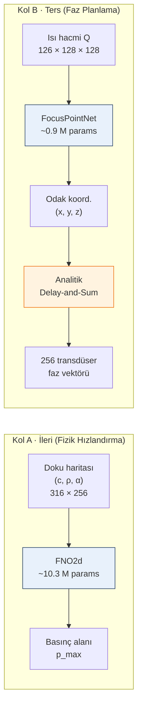

# Soft-Tissue — Heterojen Meme Dokusunda HIFU Planlaması için Sinir Vekil Modelleri

## Bu çalışma neyi çözüyor?

**Klinik sorun.** Yüksek yoğunluklu odaklanmış ultrason (HIFU) tümörü
çevre dokuya zarar vermeden termal olarak yok eder. Doğru çalışması
için odak noktasının hastaya özgü doku heterojenliği altında
**milimetrik doğrulukla** yerleştirilmesi gerekir; klinisyen
tedaviyi planlarken **saniye-altı geri bildirim** ister.

**Hesaplama darboğazı.** Bu doğruluğu üretebilecek tek referans
çözücü tam-dalga akustik simülasyondur (k-Wave gibi). Bizim
ölçtüğümüz wallclock: RTX 4070 üzerinde 316 × 256 grid, 1 MHz HIFU
için **konfigürasyon başına ~60 saniye**. Klinik akış bu hızda
kullanılamaz. Frekans-domeni Helmholtz çözücüleri, ışın izleme,
veya önceden hesaplanmış arama tabloları — her biri farklı bir
eksende tökezler (geçici bilgi kaybı, kırılma kuyruğu kaybı,
hastaya adaptasyon eksikliği).

**Yaklaşımımız.** Pipeline'ı iki kola ayırıyoruz:
- **Kol A — İleri (forward) hızlandırma:** Doku haritasından akustik
  basınç alanını tahmin eden bir **sinir operatörü** (FNO),
  k-Wave'in yerine geçiyor: **8 ms** çıkarım, **~7500× hızlanma**.
- **Kol B — Ters (inverse) faz sentezi:** İlk yaklaşımımız (256
  faz doğrudan tahmini) **fiziksel olarak ill-posed** çıktı (gauge
  simetrisi + tek-çoğa eşleme). Yeniden formüle ettik: kompakt bir
  3-B CNN sadece **odak noktasını (x, y, z)** tahmin ediyor, fazlar
  ardından **kapalı-form delay-and-sum** ile elde ediliyor.

**Bilinen şey.** AI burada bir akıl değil, **simülasyon süresi-doğruluk
Pareto'sundaki kör nokta** için bir mühendislik çözümü. Klasik
yöntemlerden hız + GPU bağımsızlığı + hastaya adaptasyon üçlüsünü
aynı anda alabilen bir yol yok; AI vekil modeli tam bu boşluğa
oturuyor.

> Sempozyum makalesi için hazırlanan çalışma deposudur. Ters problem
> simülatörü ve k-Wave doğrulamaları, ITÜ'deki işbirlikçi ekiple
> ortak olarak yürütülmektedir.

---

## Şu Anki Durum (2026-04-25, sempozyum deadline 2026-05-01)

| Kalem | Durum |
|---|---|
| 2-B ileri basınç alanı vekili (FNO) | ✅ Çalışıyor — test rel-L2 **0.097** |
| 2-B omurga ablasyonu (FNO / U-Net / ConvNeXt) | ✅ Tamam |
| 3-B ters odak-nokta regresyonu (FocusPointNet) | ✅ Çalışıyor — test RMS **26.25 mm** |
| 3-B multi-seed mimari karşılaştırması (3×3) | ✅ Tamam — üç omurga lateralde denk |
| Gauge simetrisi üçlü doğrulaması | ✅ Analitik + sentetik + k-Wave (Eren) |
| Faz-kuantizasyon çalışması (5° / 10° / 15°) | ✅ 5° pipeline'a adopte edildi |
| Isı-haritası / DSNT varyantı (nnLandmark tarzı) | ✅ Baseline ile parite (25.27 mm) |
| Sempozyum abstract — Kol A (forward) | ✅ [abstract_a_en.pdf](reports/abstract_a_en.pdf) · [abstract_a_tr.pdf](reports/abstract_a_tr.pdf) |
| Sempozyum abstract — Kol B (inverse) | ✅ Hazır — [abstract_b_en.pdf](reports/abstract_b_en.pdf) · [abstract_b_tr.pdf](reports/abstract_b_tr.pdf) |
| Klasik gold-standard kıyaslama (Kol B) | ✅ Tamam — lateral X 3.0× / Y 5.3× iyileşme · [gold_standard.md](outputs/focus_arch_compare/gold_standard.md) |
| Fizik brifingi + I/O spec + literatür notları | ✅ [physics_first_brief.md](reports/physics_first_brief.md), [inputs_and_normalization.md](reports/inputs_and_normalization.md), [literature_notes.md](reports/literature_notes.md) |
| Teslim paketi | ✅ `sent.zip` (5.2 MB, 21 dosya) |
| Sonraki iterasyon: transfer learning + 500 örnek | ⏳ Plan netleşti — [future_work_ai.md](reports/future_work_ai.md) |

---

## Pipeline — İki Kol Akışı

**Mavi bloklar** öğrenilmiş modeller, **turuncu blok** bilinen kapalı-form
fizik. Gauge serbestliğini ayrı bir öğrenme hedefi yapmak yerine Kol B'yi
3 serbestlik derecesine (x, y, z) indirgeyip fazı analitik hüzmelendirmeye
bıraktık — detayları [Ne Yaptık?](#ne-yaptık) bölümünde.

---

## Ne Yaptık?

İki koldan ilerledik (forward fizik hızlandırma + inverse faz planlama).
Adım adım:

1. **İlk denenen "hedef → 256 faz" doğrudan regresyonu öğrenmedi.**
   Tanılama iki yapısal sebebi ortaya koydu:

   | Patoloji | Ampirik imza |
   |---|---|
   | **Tek-çoğa eşleme** — aynı hedefi üreten çok sayıda faz seti var | En yakın komşu faz vektörlerinin dairesel-kosinüs benzerliği: **0.002 ± 0.043** (gürültü düzeyinde) |
   | **Gauge / global faz belirsizliği** — tüm fazlara sabit eklenince odak kımıldamıyor | +20° offset: odak kayması **0 mm**, yoğunluk değişimi **<%1** |

   Her ikisi de eğitim eğrisine bakıp anlaşılamıyor (loss hafif düşüyor
   → plato → "modeli büyütsem?"); tanı metrikleri yazıldığında netleşti.

2. **Formülasyonu değiştirdik — pipeline'ı ikiye böldük.** Fiziğin
   sağlam olduğu yerde fiziği koruduk, AI'ı yalnızca somut kazanç
   verdiği yerde devreye aldık:
   - **Kol A — 2-B ileri basınç alanı vekili.** Doku haritasından
     (ses hızı / yoğunluk / soğurma) k-Wave basınç alanını FNO ile
     tahmin ediyoruz. FNO'nun spektral (FFT temelli) yapısı dalga
     denkleminin Green fonksiyonuna doğrudan uyuyor.
   - **Kol B — 3-B ters odak-nokta regresyonu.** Modelden 256 faz
     yerine **odak koordinatını (x, y, z)** istiyoruz. 3 serbestlik
     derecesi → tek-çoğa ve gauge sorunları ortadan kalkıyor.
     Transdüser fazları bu noktadan **analitik delay-and-sum
     hüzmelendirme** ile üretiliyor (bilinen kapalı-form).

3. **Mimari karşılaştırmalarını yaptık.** Kol A'da üç model (FNO /
   U-Net / ConvNeXt), Kol B'de beş model (düz CNN / ResNet-3D /
   çok-ölçekli UNet-encoder / ısı-haritası DSNT / ısı-haritası+offset).
   Seed gürültüsünü elemek için **Kol B'yi 3 farklı seed × 3 omurga =
   9 bağımsız koşu** ile tekrarladık (120 epoch/koşu). Ayrıca 2025
   sempozyumlarında çıkan **nnLandmark / H3DE-Net** tarzı ısı-haritası
   regresyonunu da ablasyona dahil ettik (detaylar aşağıda).

4. **Gauge serbestliğini üç bağımsız yoldan doğruladık** — sinyal
   işleme tarafında temel ama deneyle pekiştirmek gerekiyor:
   - **Analitik** — delay-and-sum denkleminden türettim (`+δ` fazdan
     faktör olarak çıkıyor, girişim desenini değiştirmiyor).
   - **Sentetik** — 256 elemanlı düzlem dizide en-küçük-kareler
     faz-plus-offset fit'i: `+20°` için yoğunluk değişimi **%1'in
     altı**, odak kayması **0 mm**.
   - **Tam-dalga k-Wave** — Eren aynı testi tam fizik simülatöründe
     tekrar etti: yine **0 mm kayma, %1'in altı yoğunluk**.

   Bu mutabakat pratik sonuç veriyor: gelecekteki her faz regresörünün
   çıktı uzayını gauge'la bölmek gerekiyor (meselâ `phase[0] = 0`
   sabitleyerek). Bu sahte bir serbestlik derecesini atıp optimizasyonu
   temizliyor.

5. **Faz kuantizasyonunu karakterize ettik** — gerçek transdüser
   sürücüleri fazı ayrık adımlarla yuvarladığı için bu hassasiyet
   kaybını ölçtük: **5° adımda akustik yoğunluk hatası %0.35**,
   odak kayması **0.1 mm'nin altı**. Bu sınırlar içinde kaldığımız
   için **5°'yi pipeline varsayılanı** yaptık. Gauge fix + 5°
   kuantizasyon birlikte, hem öğrenmeye uygun hem fiziksel olarak
   sadık bir **ayrık, gauge-sabit çıktı uzayı** veriyor.

## Ne Bulduk? (Başarım Skorları)

### Kol A — 2-B ileri basınç alanı (1 000 OpenBreastUS örneği)

| Omurga        | Params  | Test rel-L2 |
|---------------|---------|-------------|
| **FNO2d**     | ~10.3 M | **0.097**   |
| U-Net2d       | ~7.9 M  | 0.264       |
| ConvNeXt2d    | 1.87 M  | 0.990       |

**Bulgu:** FNO'nun spektral (FFT-temelli) taban yapısı dalga
denklemine uyuyor; jenerik CNN'ler bu görevi yapmıyor. FNO U-Net'i
**2.7×**, ConvNeXt'i bir büyüklük mertebesi geçiyor.

### Kol B — 3-B ters odak-noktası regresyonu (30 hacim, 22 / 4 / 4 bölünme)

**Sinir ağı mimari karşılaştırması** (3 seed × 3 omurga + heatmap varyantı):

| Omurga       | Test RMS (mm)     | X (mm)      | Y (mm)      | Z (mm)         |
|--------------|-------------------|-------------|-------------|----------------|
| **CNN**      | **26.25 ± 4.61**  | 4.63 ± 2.21 | 2.69 ± 1.21 | 25.65 ± 4.17   |
| ResNet-3D    | 34.48 ± 3.74      | 5.90 ± 3.76 | 3.10 ± 1.36 | 33.64 ± 3.21   |
| UNet-enc     | 34.17 ± 8.01      | 3.93 ± 0.70 | 3.02 ± 1.05 | 33.71 ± 8.32   |
| Heatmap-DSNT | 25.27             | 4.80        | 7.04        | **23.79**      |

**Klasik gold-standard kıyaslama** (3 seed × 5 closed-form yöntem,
aynı bölüm) — [tam tablo](outputs/focus_arch_compare/gold_standard.md):

| Yöntem                      | Test RMS (mm) | X (mm) | Y (mm) | Wallclock |
|-----------------------------|---------------|--------|--------|-----------|
| argmax(Q)                   | 70.09 ± 10.6  | 39.93  | 35.26  | 0.5 ms    |
| **weighted centroid**       | **32.75 ± 2.5** | 13.82  | 14.23  | 49 ms     |
| threshold (>0.85·Qmax)      | 67.85 ± 9.7   | 37.62  | 33.98  | 53 ms     |
| parabolic refinement        | 70.12 ± 10.6  | 39.95  | 35.11  | 0.6 ms    |
| Gaussian-smooth + argmax    | 68.28 ± 8.8   | 37.63  | 37.49  | 37 ms     |
| **FocusPointNet (öğrenilmiş)** | **26.25 ± 4.6** | **4.63** | **2.69** | **9 ms** |

**Bulgular:**
- **Lateral doğruluk mimari-bağımsız** — üç CNN omurgası ve heatmap
  DSNT varyantı 3–6 mm aralığında, HIFU doğal focal spot'un (~6 mm)
  içinde. "İyi sonuç" görevin özelliği, tek bir modelin değil.
- **Heat tepesi ≠ hedef.** Tüm peak-finder klasik yöntemler (argmax,
  threshold, parabolic, Gaussian) 65-80 mm RMS'de takılır çünkü doku
  kırılması altında ısı tepesi istenen hedeften 30-50 mm ötelenir.
  Bu, gauge-aware reformülasyonumuzun dolaylı bir doğrulamasıdır:
  "AI sistematik biası öğreniyor".
- **FocusPointNet, en güçlü klasik temele kıyasla lateral X'te 3.0×,
  Y'de 5.3× iyileşme** sağlıyor (Z eşit, veri-kısıtlı).
- **Heatmap DSNT'in eksenelde marjinal kazancı**, eksenel sorunun
  veri rejiminden kaynaklandığının ek kanıtı.

## Bilinen Sınırlar (Limitations)

Dürüst olmak gerekirse, bu çalışma sempozyum versiyonunda şu
sınırlamaları taşıyor — paper içinde bunlar açıkça belirtilecek:

1. **Eksenel (Z) doğruluğu klinik için yetersiz.** 25-26 mm Z RMS,
   tipik HIFU lezyon uzunluğunun ötesinde. Sebep teknik değil veri:
   30 simülasyonluk veri seti + Z menzilinin lateral menzilin 2×
   olması. ITÜ ortağımızın 500+ örnek üreteceği genişletilmiş set
   geldiğinde sub-15 mm hedeflenir; transfer learning (SAM-Med3D /
   MONAI) eklenirse sub-5 mm.
2. **Kol A henüz doğrudan kullanılabilir bir tedavi değildir.**
   FNO basınç alanını saniyenin binde 1'inde tahmin ediyor — ama
   bu kendi başına klinik karar üretmez. Tam pipeline (forward
   vekil + iter. faz optimizasyonu) entegrasyonu sonraki iterasyona
   kalıyor.
3. **k-Wave referansı kendisi de bir model.** 2-B düzlem dilim
   varsayımı 3-B kırılma etkilerinin bir kısmını ihmal eder. Tam
   3-B referansa geçiş hesaplama maliyeti nedeniyle henüz
   yapılmadı (3-B simülasyon başına ~30 dakika).
4. **OpenBreastUS *in silico* fantomlardan türetilmiş.** Gerçek
   hasta MR'larından doğrudan türetilmiş olsalar da, sentetik
   transdüser geometrisi ve homojen su tabakası varsayımları taşır.
   Klinik validasyon ileri adım.
5. **Gauge fix konvansiyonu (`φ₀ = 0`) keyfi.** Eşdeğer fakat
   farklı temsilciler seçilebilir; downstream donanım entegrasyonu
   için bu seçim transdüser sürücüsünün sıfır referansıyla
   hizalanmalı.
6. **Klasik gold-standard kıyaslamamız *closed-form* yöntemlerle
   sınırlı.** Tam k-Wave forward üzerinde iteratif faz optimizasyonu
   (örn. CG / adjoint metodu) ile karşılaştırma planlandı ancak
   sempozyum öncesi koşturulmadı.

## Gelecek Çalışmalar

Kazanç potansiyeline göre sıralı:

1. **Transfer learning** (SAM-Med3D / MONAI ile pretrained 3-B
   encoder). Beklenen eksenel RMS düşüşü: 26 mm → 10–15 mm (mevcut
   veri), sonra sub-5 mm (500+ örnekle).
2. **Daha çok simülasyon** — ITÜ işbirlikçimiz 500+ örnek üretiyor.
3. **Kol A'da Transolver / GNOT** — beklenen %30–50 daha düşük rel-L2.
4. Pipeline içinde **gauge-sabit + 5° kuantizasyonlu çıktı uzayı**
   üzerinde yeniden faz regresyonu denemesi.

Ayrıntılı analiz (YOLO neden uygun değil, hangi SOTA gerçekten işe
yarar, transfer learning neden en büyük kazancı verir):
➜ [`reports/future_work_ai.md`](reports/future_work_ai.md)

## Sempozyum Abstract Durumu

Danışmanın önerisi doğrultusunda **iki ayrı abstract** hazırlandı (1 sayfa
× 2 sunum). İkisi de gold-standard kıyaslama numaraları ile güncel ve
sempozyum gönderimine hazır.

| Kol | İngilizce | Türkçe | Not |
|---|---|---|---|
| **A — Forward (FNO)** | [abstract_a_en.pdf](reports/abstract_a_en.pdf) | [abstract_a_tr.pdf](reports/abstract_a_tr.pdf) | Klinik motivasyon + k-Wave wallclock kıyası + veri seti gerekçesi + omurga ablasyon novelty |
| **B — Inverse (3-DOF)** | [abstract_b_en.pdf](reports/abstract_b_en.pdf) | [abstract_b_tr.pdf](reports/abstract_b_tr.pdf) | Gauge-aware reformulation + örnek-verimlilik + 5° kuantizasyon + 5 klasik gold-standard ile çoklu-seed kıyas |
| _(legacy birleşik)_ | [abstract_en.pdf](reports/abstract_en.pdf) | [abstract_tr.pdf](reports/abstract_tr.pdf) | Pazartesi'ye kadar referans amaçlı |

- **Ana görsel rapor**: [`reports/sonuclar.pdf`](reports/sonuclar.pdf)
- **Toplantı hazırlık dokümanları**:
  - [`reports/pazartesi_toplanti.md`](reports/pazartesi_toplanti.md) — **Pazartesi 28.04 toplantı gündemi**, tüm tartışılacak konular
  - [`reports/physics_first_brief.md`](reports/physics_first_brief.md) — fizik perspektifinden anlatım
  - [`reports/inputs_and_normalization.md`](reports/inputs_and_normalization.md) — model girdi/çıktı tam spesifikasyonu
  - [`reports/literature_notes.md`](reports/literature_notes.md) — danışmanın paylaştığı IEEE referansları
- Teslim paketi: `sent.zip` (`scripts/build_sent_bundle.py` ile yeniden üretilir)

## Sıkça Sorulan Sorular

Proje sürecinde ortaya çıkan dört merkezi soru ve güncel cevapları.

---

### S1 · Sempozyum kapsamı için 2-B ileri problem tek başına yeterli mi, yoksa 3-B ters problem de gerekli mi?

**Kol A (2-B FNO) kendi başına yayıma uygun, tamamlanmış bir
sonuçtur.** Test rel-L2 **0.097**, U-Net'in 2.7 katı daha iyi; figürler
makaleye doğrudan girecek kalitede. Bu nedenle abstract'ın *ana
omurgası* Kol A üzerine kuruldu.

Kol B (3-B odak-nokta regresyonu) abstract'ta **tamamlayıcı / ikincil
katkı** olarak konumlandı. 30 örnekle **lateral 5 mm** (focal spot
içi) elde edildi, ancak eksenel eksende veri kısıtı baskın — bu kolun
tamamlanması 500+ simülasyonluk genişletilmiş veri setini bekliyor.
Sempozyum versiyonu için oran: **%70 Kol A, %30 Kol B**.

---

### S2 · Benzer alandaki literatür taraması yapıldı mı? Makalenin *novelty* ekseni nasıl kurgulanıyor?

İki karşılaştırma ekseni netleşti:

| Eksen | Öne çıkan literatür | Bizim farkımız |
|---|---|---|
| **İleri simülasyon hızlandırma** | TUSNet (Shenoy 2022), DeepTFUS (Yıldız 2023), Stanziola (2023) | OpenBreastUS + 1 000 örnek + üç omurgalı ablasyon |
| **HIFU ters problem (öğrenilmiş)** | Mendez Peñalver 2022 (klasik opt.), birkaç learning-based çalışma | 3-DOF yeniden formülasyon + analitik delay-and-sum hibrit |

**Novelty üç maddede** (abstract'ta aynı sırada):

1. **OpenBreastUS'un HIFU planlamada ilk kullanımı** — orijinal yayın
   ultrason computed tomography içindi.
2. **Gauge serbestliği + faz kuantizasyonu ampirik karakterizasyonu** —
   bizim regresörümüzden bağımsız olarak klasik faz optimizatörleri
   için de değerli.
3. **Örnek-verimli odak-nokta ağı + analitik hüzmelendirme hibrit
   pipeline'ı** — gerçek zamanlı, hastaya özel planlama için yapı
   taşı.

Introduction için kullanılabilecek hazır materyal:
[`reports/abstract_en.pdf`](reports/abstract_en.pdf),
[`reports/sonuclar.pdf`](reports/sonuclar.pdf).

---

### S3 · Proje sonuçlarını birlikte gözden geçirmek için ne tür materyaller hazır?

| Kanal | İçerik | Boyut |
|---|---|---|
| **Bu depo** | Tüm kod + figürler + JSON sonuçları | ~10 MB |
| **`sent.zip`** | Tek paket: figürler, tablolar, abstract'lar, görsel rapor, gold-standard tablosu | 5.4 MB |
| **[`reports/sonuclar.pdf`](reports/sonuclar.pdf)** | Ekran paylaşımı için uygun görsel rapor | 1.5 MB |
| **Sempozyum abstract'ları** (Kol A + Kol B, EN + TR) | [a_en](reports/abstract_a_en.pdf), [a_tr](reports/abstract_a_tr.pdf), [b_en](reports/abstract_b_en.pdf), [b_tr](reports/abstract_b_tr.pdf) | ~400 KB toplam |
| **Toplantı brief'leri** | [physics_first_brief.md](reports/physics_first_brief.md), [inputs_and_normalization.md](reports/inputs_and_normalization.md), [literature_notes.md](reports/literature_notes.md) | — |
| **Canlı inference** | Eğitilmiş modeller yerel makinede hazır; yeni girdide çıktı üretilebilir | — |

Toplantı: **Pazartesi 28.04.2026, ofiste, öğleden sonra**
(11:30-13:30 arası danışman uygun değil).

---

### S4 · Sempozyum alanındaki yapay zeka makaleleri ne ölçüde incelendi? SOTA mimariler bu çalışmaya nasıl konumlanıyor?

İnceleme iki koldan yürütüldü:

- **Mimari / yöntem analizi — ✅ tamamlandı.** Hangi modeller bu göreve
  uygun, hangileri moda ama uyumsuz (YOLO vakası), cutting-edge
  rakiplerin (Transolver, GNOT, SwinUNETR, U-Mamba, SAM-Med3D) beklenen
  katkısı ve bizim 30-örnek rejiminde **en büyük kazancın mimariden
  değil transfer learning'den** geleceğinin sayısal gerekçesi
  ➜ [`reports/future_work_ai.md`](reports/future_work_ai.md).
- **Sempozyumun geçmiş yıl AI makaleleri incelemesi — ⏳ devam ediyor.**
  Neyi ne derinlikte tartışmışlar, üç-maddelik novelty listemizin hangi
  boşluğu kapattığı tarafı introduction taslağıyla eş zamanlı
  tamamlanacak. Kol B ampirik tablosu oturduğundan bu aşamada başlaması
  anlamlı hale geldi.

---

## Teknik Detaylar

Bu README proje özetidir. Daha ayrıntılı teknik anlatım (ilk yaklaşımın
neden başarısız olduğu, gauge simetrisi türetimi, ısı-haritası
ablasyonunda üç ampirik bulgu, mimari seçim gerekçeleri, tam tablolar
ve reproduksiyon adımları) ayrı bir dosyada:

➜ **[`reports/teknik_detaylar.md`](reports/teknik_detaylar.md)**

İlgili dosyalar:

- [`reports/abstract_en.pdf`](reports/abstract_en.pdf) — sempozyum abstract (İngilizce)
- [`reports/abstract_tr.pdf`](reports/abstract_tr.pdf) — sempozyum abstract (Türkçe)
- [`reports/sonuclar.pdf`](reports/sonuclar.pdf) — ana görsel rapor
- [`reports/future_work_ai.md`](reports/future_work_ai.md) — cutting-edge mimari yol haritası
- [`outputs/focus_arch_compare/multi_seed_summary.md`](outputs/focus_arch_compare/multi_seed_summary.md) — multi-seed ablasyon ham tablo
- [`outputs/focus_arch_compare/summary.md`](outputs/focus_arch_compare/summary.md) — Kol B konsolide özet
