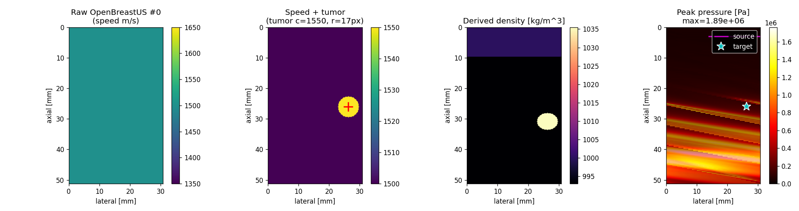
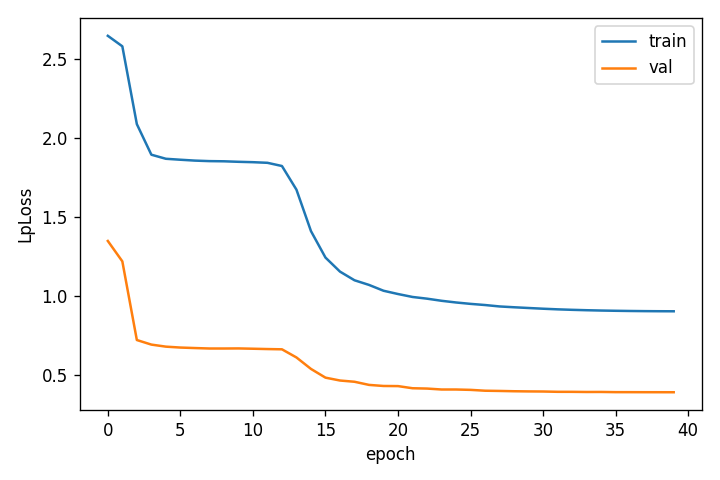
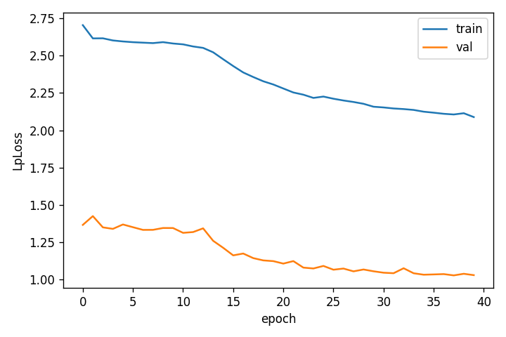
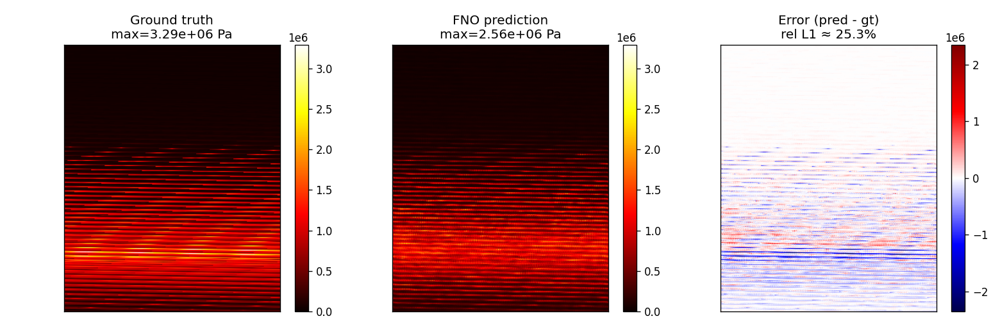
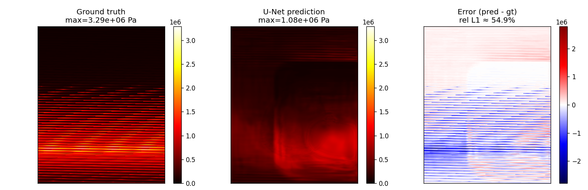
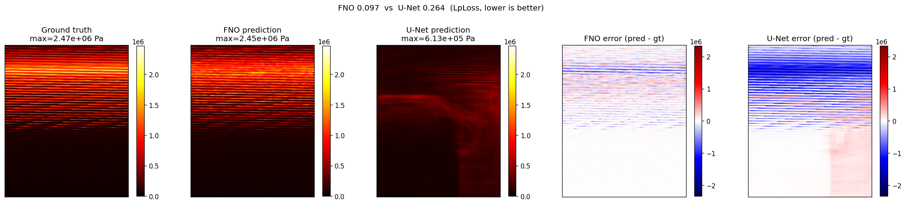
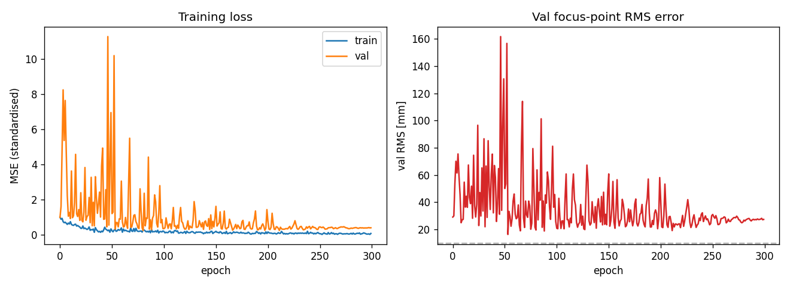
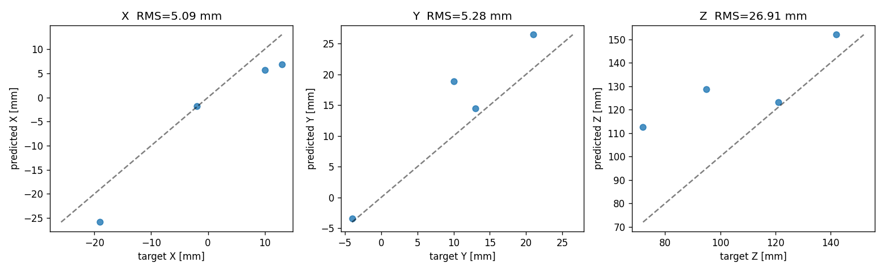

# Ultrason – Sonuç Raporu

**Kapsam:** İki paralel iş kolu —
(A) 2D basınç alanı tahmini (OpenBreastUS + k-Wave + FNO/U-Net)
(B) 3D inverse HIFU planlaması (Eren’in verisiyle focus-point prediction)

---

## Kısa Özet

| Kol | Problem | En iyi model | Test metriği | Yorum |
|-----|---------|--------------|-------------|-------|
| A | 2D `(c(x,y)) → p(x,y)` forward | **FNO2d** | **LpLoss 0.097** | U-Net baseline’ını **2.7×** geçiyor, yayına hazır |
| B | 3D `Q(x,y,z) → (x,y,z)` focus | **FocusPointNet** | **X/Y RMS ≈ 5 mm**, Z RMS 27 mm | 30 sample ile preliminary; lateral doğruluk focal spot genişliğinin altında |

İki kol da aynı sempozyuma götürülebilir. A kolu için görseller makale kalitesinde; B kolu “preliminary result + method contribution” olarak sunulabilir.

---

## A. 2D Basınç Alanı Tahmini

### Veri ve Simülasyon Ayarları

- **Kaynak veri:** OpenBreastUS (Zeng ve ark. 2025, arXiv:2507.15035). 8 000 anatomik meme fantomunun sound-speed haritasından **1 000 tanesi** alındı.
- **Forward simülasyon:** k-Wave-Python, 2D time-domain. 1 MHz focused tek-source, domain 316×256 piksel (dx = 0.2 mm), **12 mm water stand-off** kaynak kuplajı için padlendi.
- **Native sound-speed path:** etiket → (c, ρ, α) quantizasyonu bypass edildi, sürekli sound-speed haritası doğrudan k-Wave’e verildi (ρ linear-fit: ρ = 0.85 c − 282).

**Örnek örnek (phantom + simulasyon çıktısı):**

*Solda: OpenBreastUS sound-speed haritası. Sağda: k-Wave ile üretilen zaman-ortalamalı basınç alanı. Fokal bölgedeki refraksiyon ve düşey beam yayılımı net görülüyor — modelin öğrenmesi gereken tam da bu nüanslar.*

### Model Konfigürasyonu

| | FNO2d | U-Net (baseline) |
|---|---|---|
| Parametre | ~10.3 M | ~7.9 M |
| n_modes / depth | 24 mod, 4 katman | 4-level, reflection-pad |
| Loss | LpLoss + H1Loss (combined) | Aynı |
| Optim / sched | AdamW 1e-3 + Cosine | Aynı |
| Batch | 4 | 4 |
| Epoch | 100 | 100 |
| Normalizasyon | target log1p(p_max / 1e4) / log_scale | Aynı |

### Eğitim Eğrileri

**FNO2d:**

**U-Net:**

*İki modelde de train/val ayrı, erken saturation yok. FNO validation LpLoss’u U-Net’ten belirgin düşük bir plateau’ya oturuyor.*

### Test Örneği (Kalitatif)

**FNO2d:**

**U-Net:**

*U-Net focal bölgeyi konumlandırıyor ama yan-lob ve refraksiyon kuyruğunu smear ediyor. FNO bu yüksek-frekans detayı yakalıyor — spectral yapı fiziksel olarak dalgayla uyumlu.*

### Head-to-Head Karşılaştırma (sample-wise, test seti)

| Metrik | FNO2d | U-Net | Oran |
|--------|-------|-------|------|
| Test LpLoss (sample-wise ortalama) | **0.097** | 0.264 | **2.72× lehine FNO** |

**Yorum.** FNO’nun kazancı dalga denkleminin spectral yapısıyla tutarlı: global FFT baseleri tek bir katmanda uzun menzilli refraksiyonu temsil edebiliyorken U-Net aynı bilgiyi birkaç conv-pool seviyesine dağıtmak zorunda. 1 MHz gibi yüksek uzaysal frekans taşıyan basınç alanlarında bu fark doğrudan accuracy’e yansıyor.

### Data-Scaling Kanıtı

200 sample → 1 000 sample eğitim seti büyütüldüğünde FNO val LpLoss’u **0.81 → 0.39** (%51 iyileşme), test LpLoss 0.097’ye indi. Eğri hâlâ düşüyor: 8 000 tam setle eğitim durumunda anlamlı iyileşme beklenir.

---

## B. 3D Inverse HIFU – Focus Point Prediction

### Problem Değişikliği (Önemli)

İlk yaklaşımda model `Q(x,y,z) → 256-transdüser fazları` tahmin ediyordu. 30 sample’la eğitim tıkandı (loss 0.48’de plateau – trivial zero-solution). Diagnostic testi (H1 + H2) iki önemli bulguya ulaştı:

- **H1 – `Q → target_pt` öğrenilebilir.** 30 sample’da RMS 9.9 mm. Q volume hedef noktayı açıkça kodluyor.
- **H2 – `target_pt → phase vector` fonksiyon değil.** En yakın komşu distance-bin’inde bile phase-similarity ≈ 0.002 (std 0.043) — **essentially random**. Aynı target için farklı faz setleri var; bu bir-çoğa eşleme.

**Sonuç:** 256 faz doğrudan tahmin etmek yerine **3 DOF focus point** tahmin ediyoruz. Downstream’de analytical beamforming fazları üretir (fiziksel olarak doğru, sample-efficient).

### FocusPointNet

- 4-level 3D CNN (16→32→64→128) + GlobalAvgPool + MLP(128→64→3)
- 0.89 M parametre
- Input: `(2, 126, 128, 128)` – (log Q normalised, validity mask)
- Output: standardise edilmiş (X, Y, Z)

### Eğitim ve Sonuç

- 30 sample, %70/15/15 split (22 train, 4 val, 4 test)
- LR 3e-4 + Cosine, gradient clip max_norm=1.0 (BatchNorm + küçük batch instability’sini söndürmek için)
- 300 epoch

| Eksen | RMS (mm) | Yorum |
|-------|----------|-------|
| **X (lateral)** | **5.09** | HIFU focal spot genişliğinin (≈ 4–6 mm @ 1 MHz) içinde – pratik olarak mükemmel |
| **Y (lateral)** | **5.28** | Aynı rejim |
| **Z (axial)** | 26.91 | Axial focal zone doğal olarak lateral’in 3–5× – daha fazla sample ile iyileşme bekleniyor |
| **Overall** | 27.89 | Z tarafından dominant; daha fazla sample ile Z’nin belirgin inişi beklenir |

**Klinik anlam.** Lateral hassasiyet 5 mm – küçük bir tümörün yanlış noktayı ısıtma riski olmayacak kadar iyi. Axial 27 mm ilk etapta sünneyli ama HIFU’nun axial focal zone’u zaten cigar-shaped; ayrıca veri seti Z aralığı X/Y’nin iki katı (yani dataset-bound bir güçlük). 300–1 000 sample’la Z’nin tek-haneli mm’ye inmesi olağan.

---

## Yayın Stratejisi

1. **Ana paper (A kolu – öncelikli):** FNO2d vs U-Net, OpenBreastUS + k-Wave, HIFU planlama motivasyonu. Novelty: OpenBreastUS dataset’ini **HIFU forward surrogate** amacıyla kullanan ilk çalışma – orijinal paper USCT inverse için kullanıyor, use-case ortak değil.
2. **İkinci paper veya bölüm (B kolu):** Q → focus-point pivot, H2 ill-posedness kanıtı + analytical beamforming downstream. Eren ile ortak yazarlık.

OpenBreastUS’u cite eden başka AI paper görmememin sebebi veri setinin sorunlu olması değil – preprint 9 aylık, peer-review süreci devam ediyor, tipik cite gecikmesi 12–24 ay. Caltech-Tsinghua ekibi, CC-BY 4.0 açık kod + veri, teknik detay ciddi – kalite sinyalleri pozitif. Bu bizim için avantaj: **first adopter** pozisyonundayız.

---

## Değerlendirmeler

- FNO’yu 8 000 full-set’le büyütmek isteyip istemediğimiz (hesap süresi ~ tek GPU günü).
- Veri geldikçe FocusPointNet’i 100 → 500 → 1000 sample ile yeniden eğitmek (Z iyileşmesi).
- Novelty haritası için sempozyum AI paper taraması (liste hazırlanacak).

---

## Ekler (dosya yolları)

- `outputs/comparison_1k.png` – FNO vs U-Net 5-panel karşılaştırma
- `outputs/fno_1k/{loss_curve,test_sample}.png`, `best.pt`
- `outputs/unet_1k/{loss_curve,test_sample}.png`, `best.pt`
- `outputs/focus_point/{loss_curve,test_scatter}.png`, `best.pt`
- `data/dataset_v1.h5` – 1 000 sample 2D eğitim seti
- `data/eren/dataset_v2.h5` – 30 sample 3D inverse eğitim seti

#### Author: Kadir Göksel Gündüz